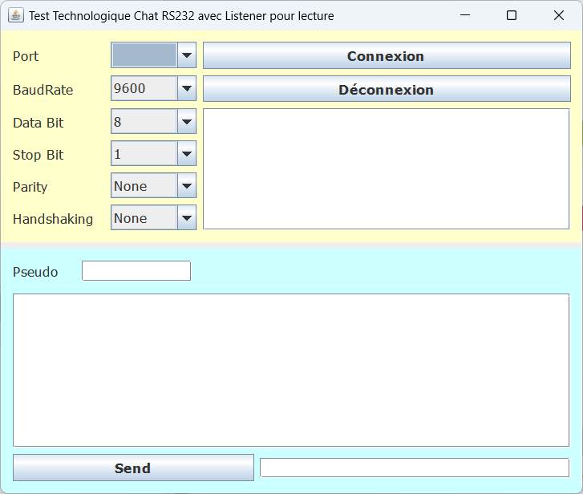

# 2-Rs232_Bluetooth
Voici un aperçu des deux applications Java RS232 Listener et Thread :

## Tâches à effectuer
Par groupe de deux apprenti(e)s, réalisez les tâches suivantes :

1) Tester une connexion Bluetooth entre deux ordinateurs de la salle, consignes page 2
2) Tester, expliquer et documenter le projet RS-232 par listener, consignes page 3
3) Tester, expliquer et documenter le projet RS-232 par thread, consignes page 3
